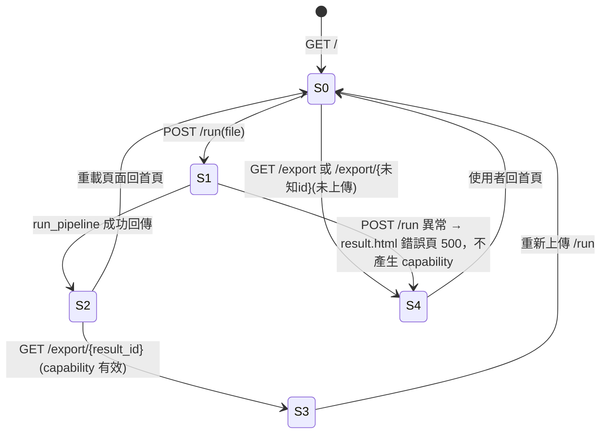
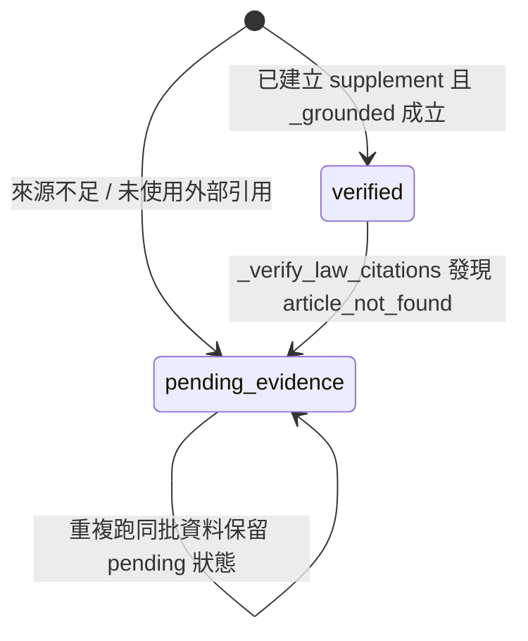

# 筆記補齊（Note-Filler）狀態轉移表（最小版）

## 版本

- 日期：2026-07-19
- 目標：把可見行為與資料流狀態收斂成最小可核實規格。

## 追溯資訊

- **設計編號**: D-02
- **需求編號**: R-06（自建模組 - 訂正稿資料結構）, R-07（品質閘）
- **驗收編號**: A-04（test_export_without_run_returns_404）, A-05（test_run_pipeline_invariant）, A-06（test_e2e_minimal_quality_gates_offline_regression）
- **追溯狀態**: 完整
- **追溯索引**: `docs/specs/design-traceability-index.md`

## 1) 頁面/流程狀態（與最後路由行為一致）

### 狀態定義

| 狀態代號 | 說明 |
|---|---|
| `S0-空白頁` | 尚未上傳任何檔案，使用者位於 `/`。 |
| `S1-產出中` | `POST /run` 已接到請求，執行 `run_pipeline(...)`（短暫伺服器端處理）。 |
| `S2-已產生訂正稿` | `/run` 成功完成，`app.state.results[result_id]` 已設值，頁面顯示雙欄結果與 capability 連結。 |
| `S3-可匯出` | 呼叫 `/export/{result_id}` 且對應 capability 存在且未過 TTL。 |
| `S4-不可匯出` | 呼叫 `/export` 或 `/export/{result_id}` 時無對應 capability（未跑、過期或重啟），回 404。 |

### 狀態轉移

### 主要實作錨點

- `app/server.py`
- `tests/test_server.py`（頁面/匯出行為）

## 2) 補充段落信心狀態（`confidence`）

### 狀態定義

| 狀態 | 進入條件 |
|---|---|
| `verified` | 以一手來源（A 或 C）或 ≥2 個相異來源使用，且非 `【待補證】` 開頭。 |
| `pending_evidence` | `text` 以 `【待補證】` 開頭，或 `_grounded()` 未通過，或法條驗證後發現缺失。 |

### 轉移規則（單向）

- `verified` 不會自動升級為更高等級；若後續驗證流程降級條件成立，可轉為 `pending_evidence`。
- `pending_evidence` 一般不升級到 `verified`（除 pipeline 重跑 / 重建文件）。

### 轉移實作

### 實作錨點

- `src/note_filler/correction.py`：`Segment`、`assemble_correction`、`_grounded`
- `src/note_filler/pipeline.py`：`_verify_law_citations`
- `tests/test_e2e_acceptance.py`、`tests/test_pipeline.py`、`tests/test_excluded_failing_controls.py`（硬閘位）

## 3) 元件子責任對應

| 元件 | 狀態主責 |
|---|---|
| `app.state.results` | 各次 `/run` 產物的能力綁定暫存（`result_id` → doc，TTL/上限逐出） |
| `run_pipeline` | 將輸入轉為 `CorrectionDoc` |
| `assemble_correction` | 建立原稿/補充段序列與 `anchor_idx` |
| `to_markdown` | 匯出結果檔案格式與檔頭 |

### 狀態證據

- `tests/test_server.py`（匯出 404/200）
- `tests/test_e2e_acceptance.py`（品質閘與 `pending_evidence`）
- `tests/test_pipeline.py`（C6 無來源時 pending 保留）

