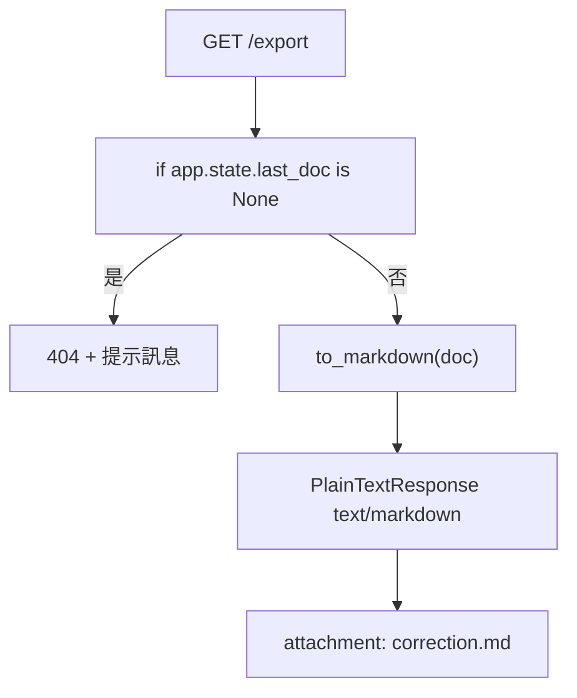

# 筆記補齊（Note-Filler）使用者流程與降級路徑（最小核實版）

## 版本

- 日期：2026-07-19

## 1) 正常流程（流程圖）

```mermaid
flowchart LR
    A["GET /"] --> B["上傳頁 index.html"]
    B --> C["POST /run(file)"]
    C --> D["app.server._build_clients()"]
    D --> E["run_pipeline(path, llm, twinkle, law)"]
    E --> F["parse_note"]
    F --> G["detect_domain"]
    G --> H["generate_questions"]
    H --> I["detect_gaps"]
    I --> J["for each gap: retrieve_for_gap"]
    J --> K["write_supplement"]
    K --> L["cross_validate(used sources)"]
    L --> M["assemble_correction"]
    M --> N{"domain == law?"}
    N -->|yes| O["_verify_law_citations"]
    N -->|no| P["回傳 CorrectionDoc"]
    O --> P
    P --> Q["app.state.last_doc = doc"]
    Q --> R["TemplateResponse result.html"]
```

### 直接實作錨點

- `app/server.py`（`run()`、`_build_clients`、`export()`）
- `src/note_filler/pipeline.py`（parse→assemble 主要鍊）
- `src/note_filler/parse.py`、`src/note_filler/domain.py`、`src/note_filler/questions.py`
- `src/note_filler/gap.py`、`src/note_filler/retrieve.py`、`src/note_filler/write.py`
- `src/note_filler/verify.py`、`src/note_filler/correction.py`
- `app/templates/result.html`

## 2) `/export` 分流流程

### 實作錨點

- `app/server.py:export`
- `src/note_filler/export.py:to_markdown`
- `tests/test_server.py::test_export_returns_markdown_attachment`
- `tests/test_server.py::test_export_without_run_returns_404`

## 3) 分支與降級規則

| 分支 | 觸發條件 | 對外行為 | 對應文件 |
|---|---|---|---|
| A | `detect_gaps` 回傳 `[]` | `assemble_correction` 只回原稿段，不新增補充 | `src/note_filler/gap.py`, `src/note_filler/correction.py` |
| B | gap 補充輸出以 `【待補證】` 開頭 | `confidence = pending_evidence`, 不改 `sources` 計入正文 | `src/note_filler/write.py`, `src/note_filler/correction.py` |
| C | `app.state.last_doc` 未建立 | `GET /export` 回 404 | `app/server.py`, `tests/test_server.py` |
| D | domain 是 `law` 且法條查核 `article_not_found` | 該段 `pending_evidence` 降級 | `src/note_filler/pipeline.py`, `src/note_filler/knowledge/law_citation_check.py` |

## 4) 最小風險註記

- 目前流程未定義「上傳失敗訊息頁面」與「pipeline 異常頁」；異常會落到框架預設錯誤路徑。
- 這是當前最小實作邊界的一部分；若要補強，需新增錯誤頁與重試入口後再補對應證據。

