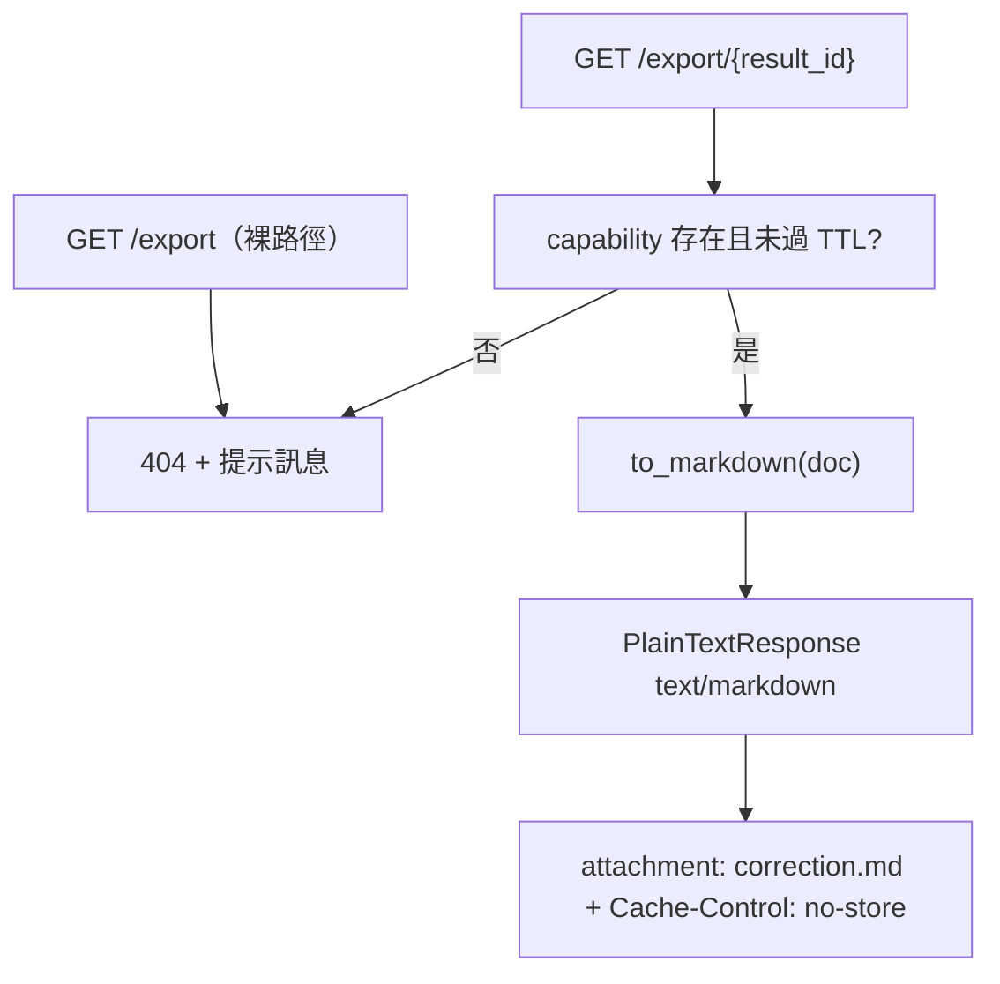

# 筆記補齊（Note-Filler）使用者流程與降級路徑（最小核實版）

## 版本

- 日期：2026-07-19

## 追溯資訊

- **設計編號**: D-03
- **需求編號**: R-01（目標與一句話定義）, R-04（系統架構）, R-05（自建模組 - Gap 偵測）, R-06（自建模組 - 訂正稿資料結構）
- **驗收編號**: A-02（test_run_renders_two_columns）, A-03（test_export_returns_markdown_attachment）, A-05（test_run_pipeline_invariant）, A-07（test_e2e_structural_invariants）
- **追溯狀態**: 完整
- **追溯索引**: `docs/specs/design-traceability-index.md`

## 1) 正常流程（流程圖）

```mermaid
flowchart LR
    A["GET /"] --> B["上傳頁 index.html"]
    B --> C["POST /run(file)"]
    C --> D["app.server._build_clients()"]
    D --> E["run_pipeline(path, llm, twinkle, law)"]
    E --> F["parse_note"]
    F --> G["detect_domain"]
    G --> H["generate_questions"]
    H --> I["detect_gaps"]
    I --> J["for each gap: retrieve_for_gap"]
    J --> K["write_supplement"]
    K --> L["cross_validate(used sources)"]
    L --> M["assemble_correction"]
    M --> N{"domain == law?"}
    N -->|yes| O["_verify_law_citations"]
    N -->|no| P["回傳 CorrectionDoc"]
    O --> P
    P --> Q["app.state.results[result_id] = doc"]
    Q --> R["TemplateResponse result.html（含 /export/{result_id} 連結）"]
```

### 直接實作錨點

- `app/server.py`（`run()`、`_build_clients`、`export()`、`export_result()`）
- `src/note_filler/pipeline.py`（parse→assemble 主要鍊）
- `src/note_filler/parse.py`、`src/note_filler/domain.py`、`src/note_filler/questions.py`
- `src/note_filler/gap.py`、`src/note_filler/retrieve.py`、`src/note_filler/write.py`
- `src/note_filler/verify.py`、`src/note_filler/correction.py`
- `app/templates/result.html`

## 2) `/export/{result_id}` 分流流程

### 實作錨點

- `app/server.py:export_result`
- `src/note_filler/export.py:to_markdown`
- `tests/test_server.py::test_export_returns_markdown_attachment`
- `tests/test_server.py::test_export_without_run_returns_404`
- `tests/test_server.py::test_export_b_cannot_receive_a_result`
- `tests/test_server.py::test_export_expired_result_returns_404`

## 3) 分支與降級規則

| 分支 | 觸發條件 | 對外行為 | 對應文件 |
|---|---|---|---|
| A | `detect_gaps` 回傳 `[]` | `assemble_correction` 只回原稿段，不新增補充 | `src/note_filler/gap.py`, `src/note_filler/correction.py` |
| B | gap 補充輸出以 `【待補證】` 開頭 | `confidence = pending_evidence`, 不改 `sources` 計入正文 | `src/note_filler/write.py`, `src/note_filler/correction.py` |
| C | 無有效 result capability（未跑/過期/重啟） | `GET /export` 或 `/export/{id}` 回 404 | `app/server.py`, `tests/test_server.py` |
| D | domain 是 `law` 且法條查核 `article_not_found` | 該段 `pending_evidence` 降級 | `src/note_filler/pipeline.py`, `src/note_filler/knowledge/law_citation_check.py` |

## 4) 最小風險註記

- `/run` 的 pipeline 異常以設計錯誤頁（`result.html` error 分支 + 500）回應，不產生 result capability；`run_pipeline` 在 threadpool 執行，不阻塞事件迴圈。
- 這是當前最小實作邊界的一部分；若要補強，需新增錯誤頁與重試入口後再補對應證據。

